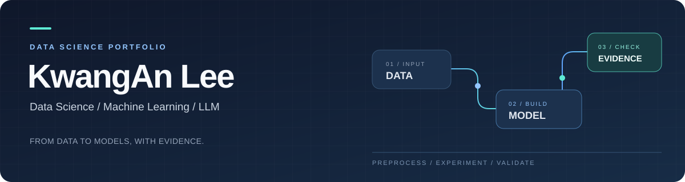

  

  <strong>데이터를 이해하고, 모델을 만들고, 근거로 검증합니다.</strong> 
  공공데이터 전처리 · 공간 데이터 모델링 · 근거 기반 LLM 추천

  <a href="#selected-projects">대표 프로젝트</a> ·
  <a href="#technical-skills">기술 역량</a> ·
  <a href="#experience">활동 이력</a>

---

## About Me

안녕하세요. 데이터 분석과 머신러닝, LLM 응용 프로젝트를 진행하고 있는 **KwangAn Lee**입니다.

서로 다른 형식의 데이터를 분석 가능한 구조로 정리하고, 문제에 맞는 모델과 평가 기준을 설계합니다. 최근에는 **LLM의 판단을 원문 근거와 연결하는 추천 엔진**, **공간 그룹 검증을 적용한 보행자 사고다발지역 분류**, **주거환경 공공데이터의 지표 모델링**에 집중했습니다.

이 페이지는 제가 맡은 역할과 확인 가능한 결과를 모은 포트폴리오입니다. 각 프로젝트의 상세 저장소에서 구현 과정, 검증 자료와 적용 범위를 확인할 수 있습니다.

## Selected Projects

<table>
<tr>
<td width="33%" valign="top">
  <h3>01 · EPICK</h3>
  
<strong>근거 기반 LLM 경험 추천</strong>

  
담당: W4 추천 엔진

  
경험 원문의 근거 추출, 문항 적합성 판단, 인용·소유권 검증, 백엔드 연동.

  
<strong>497 tests / environment</strong> 보존 CI: Windows·Linux 각각 통과

  
<a href="https://github.com/FreeRease/epick-w4-portfolio"><strong>프로젝트와 검증 자료 →</strong></a>

</td>
<td width="33%" valign="top">
  <h3>02 · DG2CAM</h3>
  
<strong>보행자 사고다발지역 모델링</strong>

  
담당: B · 모델링

  
불균형 데이터의 지표 설정, 행정동 그룹 검증, 모델 튜닝·비교, 방법·결과 정리.

  
<strong>AP 0.1388</strong> XGBoost · 외부 5-fold 평균

  
<a href="https://github.com/FreeRease/dg2cam-pedestrian-hotspots"><strong>프로젝트와 성능표 →</strong></a>

</td>
<td width="33%" valign="top">
  <h3>03 · 집:착</h3>
  
<strong>주거환경 공공데이터 분석</strong>

  
담당: 데이터 전처리 · 모델링

  
서로 다른 공간·시간 단위의 자료 정리, 가중 지표, IDW 보간, 정규화 메타데이터.

  
<strong>5개 주거환경 분야</strong> 침수 · 치안 · 의료 · 혼잡 · 소음

  
<a href="https://github.com/FreeRease/zipchak-data-modeling"><strong>프로젝트와 데이터 근거 →</strong></a>

</td>
</tr>
</table>

<strong>EPICK · 어떤 문제를 해결했나요?</strong>

자기소개서 문항에 맞는 경험을 추천할 때, 미래 계획이나 동료의 행동이 사용자의 완료한 경험으로 해석되는 오류를 다뤘습니다.

- 원문의 정보 추출과 문항·기업 조건 판단을 분리했습니다.
- 인용문·원문 위치·경험 ID·버전·소유권을 검사해 추천의 근거를 추적했습니다.
- 네 로컬 모델을 동일 사례에서 비교하고, 모델 판단과 코드 검증 후 결과를 구분해 평가했습니다.
- 팀 백엔드 결과 형식에 연결하고 중복 실행·변경·철회 상황을 처리했습니다.

고정 가상 경험 3개 시연에서 실제 추론 12회, 후보 3개 형식 검증 통과, 중복 실행의 추가 호출 0회를 확인했습니다. 이는 독립 SQLite 환경의 제한된 시연 결과입니다.

[상세 README](https://github.com/FreeRease/epick-w4-portfolio) · [검증 요약](https://github.com/FreeRease/epick-w4-portfolio/blob/main/verification-summary.json)

<strong>DG2CAM · 모델을 어떻게 검증했나요?</strong>

전국 156,902개 도로 격자와 3,524개 행정동을 분석했습니다. 일반 보행자 양성 격자는 395개로 약 0.252%여서 AP를 주 지표로 설정했습니다.

- 동일 행정동이 학습·검증에 섞이지 않도록 그룹을 분리했습니다.
- 외부 5-fold 평가와 내부 3-fold 튜닝으로 모델을 비교했습니다.
- 로지스틱 회귀·Random Forest·XGBoost·LightGBM의 성능을 검토했습니다.
- 데이터 해시, 피처 순서, 시드와 실행 환경을 기록해 결과 재현과 팀 인계를 준비했습니다.

XGBoost의 AP 평균은 0.1388로 로지스틱 회귀의 0.1123 대비 약 23.6% 높았습니다. 상위 5% 격자의 양성 Recall은 외부 fold 평균 약 89.4%였습니다. 결과는 공식 사고다발지역의 분류와 현장점검 우선순위로 해석했습니다.

[상세 README](https://github.com/FreeRease/dg2cam-pedestrian-hotspots) · [성능 비교표](https://github.com/FreeRease/dg2cam-pedestrian-hotspots/blob/main/model-comparison.csv)

<strong>집:착 · 서로 다른 데이터를 어떻게 연결했나요?</strong>

자치구·행정동·시설 지점·도로 구간 등 공간 단위가 다른 자료를 정리하고, 주거환경을 비교할 수 있는 지표를 구성했습니다.

- 인코딩, 주소·좌표, 시간대, 수치 표현을 정리하고 분야별 입력 자료를 만들었습니다.
- 의료시설 운영시간을 반영한 가중 지표를 구성했습니다.
- 소음을 dB에서 에너지로 변환해 집계하고, 거리 제곱 역수 가중치의 IDW 공간 보간을 구현했습니다.
- 분야별 원시 지표와 정규화용 분위수 메타데이터를 분리했습니다.

자료의 제공 범위, 실측값·추정값, 가상 데이터를 사용한 실험을 구분했습니다. 개인 기여는 데이터와 모델링이며, 서비스 화면은 팀 결과물입니다.

[상세 README](https://github.com/FreeRease/zipchak-data-modeling) · [분야별 메타데이터](https://github.com/FreeRease/zipchak-data-modeling/blob/main/feature-metadata.json)

## Technical Skills

| 분야 | 활용 기술 | 프로젝트에서 적용한 내용 |
| :--- | :--- | :--- |
| 데이터 처리 | Python · Pandas · NumPy · GeoPandas | 수치·주소·좌표·시간 정리, 공간 자료 결합과 집계 |
| 머신러닝 | scikit-learn · XGBoost · LightGBM · CatBoost | 분류·회귀 실험, 앙상블, 튜닝과 모델 비교 |
| 평가·검증 | Group CV · AP · ROC-AUC · Recall · MAE | 불균형 데이터 평가, 학습·검증 분리, 재현성 기록 |
| LLM 응용 | 근거 추출 · 구조화 응답 · 검증 로직 | 원문 인용 검증, 문항 적합성 판단, 모델 응답 비교 |
| 서비스 연결 | FastAPI · SQLite · GitHub Actions | 결과 형식 연동, outbox·relay, 테스트와 CI 결과 확인 |

## How I Work

**01 / 문제 정의** — 예측하거나 추천할 대상을 명확히 하고, 결과를 어디까지 해석할 수 있는지 정합니다.

**02 / 데이터와 검증 설계** — 데이터의 단위·품질·불균형을 확인하고, 평가 지표와 분할 기준을 선택합니다.

**03 / 근거를 남기는 구현** — 결과표·실행 환경·데이터 버전을 기록하고, 팀원이 후속 작업에 사용할 수 있도록 정리합니다.

## Experience

| 활동 | 내용 | 자료 |
| :--- | :--- | :--- |
| **LG Aimers / Data Intelligence 3기** | LG AI연구원 주관 활동 · 2023.07.01–2023.09.18 | [활동 대회](https://dacon.io/competitions/official/236129/overview/description) · [공식 사이트](https://www.lgaimers.ai/) |
| **제주 특산물 가격 예측 AI 경진대회** | 개인 참가 · **68위 / 1,093 · 상위 약 6.2%** | [DACON 성적 기록](https://dacon.io/myprofile/421398/competition) · [대회 소개](https://dacon.io/competitions/official/236176/overview/description) |

### 제주 특산물 가격 예측 · Competition Highlight

제주특별자치도가 주최하고 제주테크노파크와 DACON이 주관한 **제주 특산물 가격 예측 AI 경진대회**에 개인 참가했습니다. 양배추·무·당근·브로콜리·감귤 등 제주 대표 특산물의 가격을 예측하는 **시계열 회귀 과제**로, 예측 오차는 **RMSE**를 기준으로 평가했습니다.

DACON 프로필의 완료된 대회 기록에서 **68위 / 1,093**을 기록했으며, 이는 순위를 기준으로 계산한 **상위 약 6.2%**에 해당합니다. 농산물 가격 예측 문제에 머신러닝을 적용하고, 대회 평가를 통해 예측 결과를 확인한 경험입니다.

순위 출처: <a href="https://dacon.io/myprofile/421398/competition">kwanganlee의 DACON 완료 대회 기록</a> · 평가 기준: <a href="https://dacon.io/competitions/official/236176/overview/rules">공식 대회 규칙</a> · 상위 비율: 68 ÷ 1,093 × 100 ≈ 6.22%

대표 프로젝트의 개인 담당 범위와 검증 결과는 각 저장소에 별도로 정리했습니다.

---

  <strong>Explore the work</strong>  
  <a href="https://github.com/FreeRease/epick-w4-portfolio">EPICK</a> &nbsp; / &nbsp;
  <a href="https://github.com/FreeRease/dg2cam-pedestrian-hotspots">DG2CAM</a> &nbsp; / &nbsp;
  <a href="https://github.com/FreeRease/zipchak-data-modeling">집:착</a>

